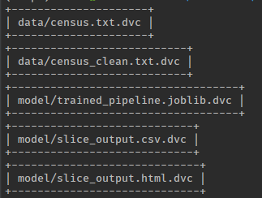
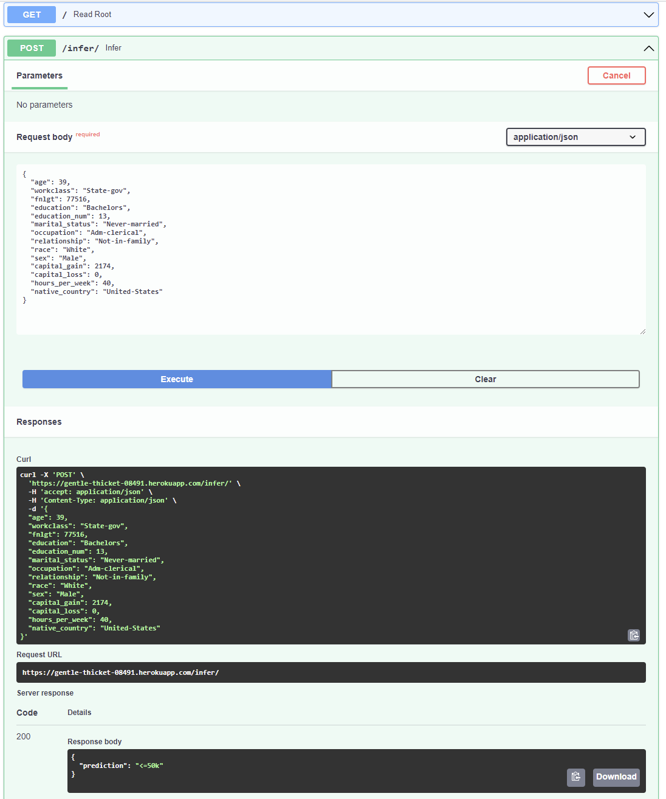
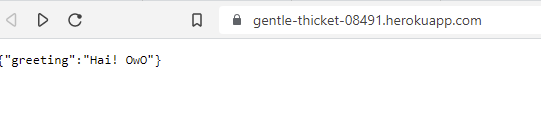
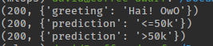

## Public Repo Link
[Here](https://github.com/dkloving/udacity_mlops_p3)

## Git and DVC
See Github Actions in public repo.

Note that files comitted to dvc include a single sklearn pipeline which includes both the trained classifier and onehot encoder.

## Model Building

I have totally reworked the project starter code. All model-building code is in the `ml` folder.

Model file, slice results, and card are all in the `model` folder.

## API Creation

Local tests are in `api_tests.py`

## API Deployment

Tests for deployed api are in `heroku_test.py`. These can be executed with `pytest heroku_test.py`.

The app is live at `https://gentle-thicket-08491.herokuapp.com/`

